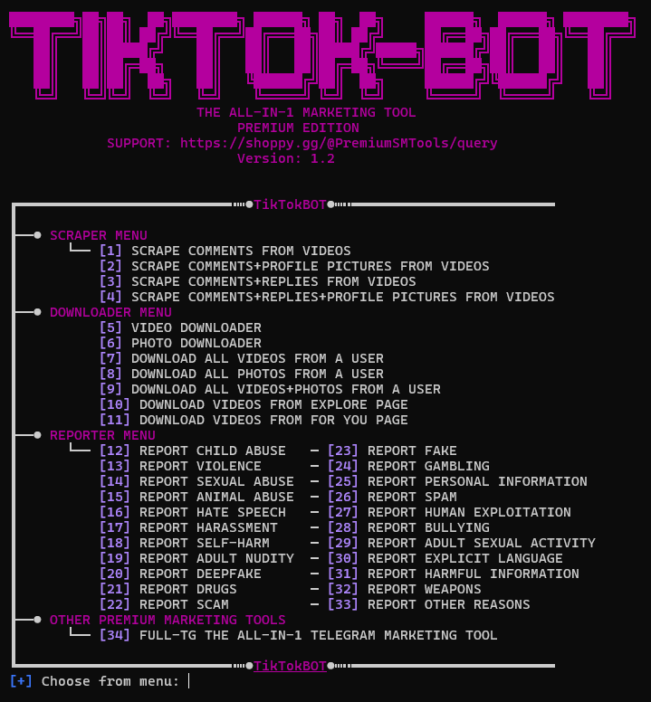

# What is TikTok Scraper?
TikTok Scraper is a powerful all-in-one tool for scraping and automating tasks on TikTok. Built with simplicity and speed in mind, it's fully automated, easy to install, and beginner-friendly—no coding skills required! Comes with +33 powerful functions for scraping, downloading, reporting, and much more.

✅ Simple to install – Easy to use – Lifetime updates and support!

## Get It Here: https://rb.gy/c4dtu4

For any questions, feel free to ask us: https://rb.gy/0uju8i

🚀 **Key Features without any limits:**
- Scrape Comments from any TikTok video
- Scrape Replies and nested comment threads
- Scrape Profile Pictures from commenters or reply authors
- Download TikTok Videos (no watermark)
- Download Photos from any TikTok post (no watermark)
- Mass Download videos and/or photos from any TikTok user (no watermark)
- Explore/For You Page Downloads supported
- Anonymous Reporting System – flag violations like child abuse, scams, hate speech, nudity, and more
- Works without a TikTok Account – No login required
- Zero Rate Limits – Run tasks at full speed
- Cross-Platform Support – Works on Windows, Linux, and macOS
- Lightweight and Fast – Efficient scraping engine
- User-Friendly Interface – Clean CLI menu for smooth navigation
- Safe & Private – No trace, no bans, fully anonymous
- Frequent Updates – New features added regularly

## **Get It Here:** https://rb.gy/c4dtu4

For any questions, feel free to ask us: https://rb.gy/0uju8i

🧠 **Why TikTokBot?**
1. Scrape, download, and report without an account
2. Extract data in bulk with no rate limits
3. Save entire user profiles or individual posts
4. Fully plug-and-play – no API keys, no setup hassles
5. Use for research, content backup, moderation, or automation
6. Anonymous by design – private and secure scraping
7. Built for speed – scrape thousands of items in seconds
8. Active development – we implement user-requested features!
9. Works out of the box on all major systems
10. Loved by our community – 100% positive feedback

⭐ Please Star the Repo to Support the Project!

Also <a href="https://tksave.com/">TKSave</a> build with this code

